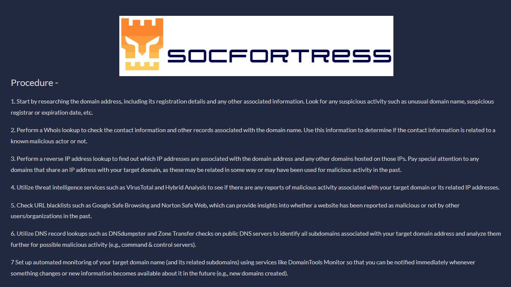
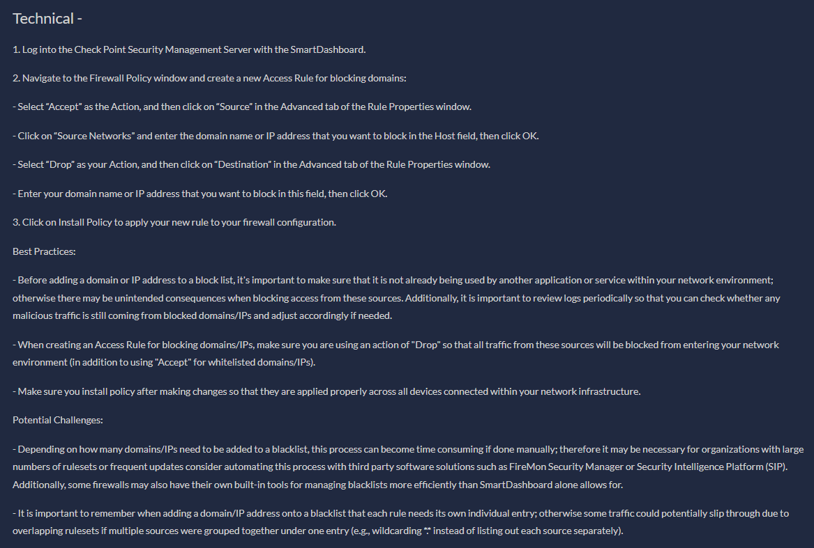
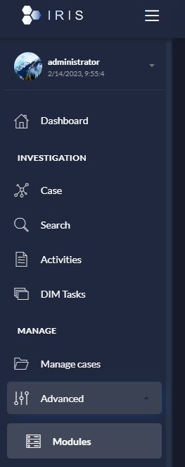
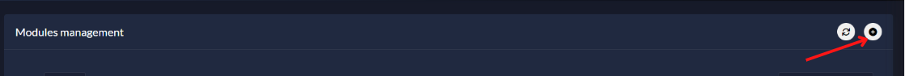
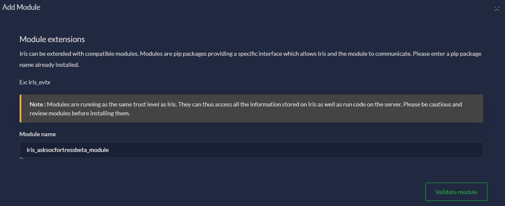
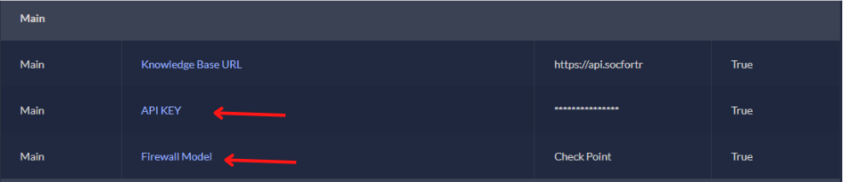

[](https://www.socfortress.co/)

# ASK SOCFortress [](https://www.socfortress.co/trial.html)
> Your Open-Source SOC Assistant


[![MIT License][license-shield]][license-url]
[![LinkedIn][linkedin-shield]][linkedin-url]
[](https://www.socfortress.co/trial.html)

<!-- PROJECT LOGO -->
<br />
<div align="center">
  <a href="https://github.com/socfortress/integrations">
    
  </a>

  <h3 align="center">ASK SOCFortress</h3>

  <p align="center">
    Your Open-Source SOC Assistant
    <br />
    <a href="https://github.com/Shuffle/Shuffle/blob/main/.github/install-guide.md"><strong>Sign Up Now »</strong></a>
    <br />
    <br />
  </p>
</div>

## **Currently in Beta**


<!-- TABLE OF CONTENTS -->
<details>
  <summary>Table of Contents</summary>
  <ol>
    <li>
      <a href="#intro">Intro</a>
    </li>
    <li>
      <a href="#install">Install</a>
    </li>
    <li>
    <a href="#configuration">Configuration</a>
    </li>
    <li>
    <a href="#running-the-module">Running the Module</a>
    </li>
  </ol>
</details>


<!-- Intro -->
# Intro
Welcome to Your Open-Source SOC Assistant, your go-to solution for improving your organization's security operations center (SOC). Built into our favorite `Open-Source` tools, ASK SOCFortress help analysts investigate alerts that pertain to IPs, domains, and file hashes. ASK SOCFortress streamlines and simplifies SOC investigations, saving time and improving accuracy.

Whether you're a security analyst or a member of a SOC team, Your Open-Source SOC Assistant can help you investigate alerts and provide technical assistance to enhance your security posutre. The module currently integrates with `DFIR-IRIS` (Shuffle coming soon) making it a valuable addition to any security operations workflow.

Our open-source project is constantly evolving, with new playbooks, features, and integrations. We welcome contributions and feedback from the community, so please feel free to get involved and help make ASK SOCFortress even better.

Get started today and see how ASK SOCFortress can take your security operations to the next level.

<div align="center" width="100" height="100">

  <h3 align="center">Procedure</h3>

  <p align="center">
    <br />
    <a href="https://www.socfortress.co/">
    
    </a>
    <br />
    <br />
  </p>
</div>

<div align="center" width="100" height="100">

  <h3 align="center">Technical</h3>

  <p align="center">
    <br />
    <a href="https://www.socfortress.co/">
    
    </a>
    <br />
    <br />
  </p>
</div>


<!-- Install -->
# Install
Currently, ASK SOCFortress can be ran as `DFIR-IRIS` Module. </br>

> Get started with DFIR-IRIS: [Video Tutorial](https://youtu.be/XXyIv_aes4w)

### The below steps assume you already have your own DFIR-IRIS application up and running.

1. Fetch the `ASK SOCFortress` Repo
    ```
    git clone https://github.com/socfortress/ASK-SOCFortress
    cd ASK-SOCFortress
    ```
2. Install the module
    ```
    ./buildnpush2iris.sh -a
    ```

<!-- Configuration -->
# Configuration
Once installed, configure the module to include:
* API Key
* Firewall Vendor

> Register for an API Key here: *insert link*

> [Current supported Firewall Vendors](https://github.com/socfortress/ASK-SOCFortress/blob/main/firewalls/README.md)

1. Navigate to `Advanced -> Modules`

<div align="center" width="100" height="50">

  <h3 align="center">Advanced -> Modules</h3>

  <p align="center">
    <br />
    <a href="https://www.socfortress.co/">
    
    </a>
    <br />
    <br />
  </p>
</div>

2. Add a new module

<div align="center" width="100" height="50">

  <h3 align="center">Add a new module</h3>

  <p align="center">
    <br />
    <a href="https://www.socfortress.co/">
    
    </a>
    <br />
    <br />
  </p>
</div>

3. Input the Module name: `iris_asksocfortressbeta_module`

<div align="center" width="100" height="50">

  <h3 align="center">Input Module</h3>

  <p align="center">
    <br />
    <a href="https://www.socfortress.co/">
    
    </a>
    <br />
    <br />
  </p>
</div>

4. Configure the module

<div align="center" width="100" height="50">

  <h3 align="center">Configure Module</h3>

  <p align="center">
    <br />
    <a href="https://www.socfortress.co/">
    
    </a>
    <br />
    <br />
  </p>
</div>

<!-- Running the module -->
# Running the Module


<!-- MARKDOWN LINKS & IMAGES -->
<!-- https://www.markdownguide.org/basic-syntax/#reference-style-links -->
[contributors-shield]: https://img.shields.io/github/contributors/socfortress/Wazuh-Rules
[contributors-url]: https://github.com/socfortress/Wazuh-Rules/graphs/contributors
[forks-shield]: https://img.shields.io/github/forks/socfortress/Wazuh-Rules
[forks-url]: https://github.com/socfortress/Wazuh-Rules/network/members
[stars-shield]: https://img.shields.io/github/stars/socfortress/Wazuh-Rules
[stars-url]: https://github.com/socfortress/Wazuh-Rules/stargazers
[issues-shield]: https://img.shields.io/github/issues/othneildrew/Best-README-Template.svg?style=for-the-badge
[issues-url]: https://github.com/othneildrew/Best-README-Template/issues
[license-shield]: https://img.shields.io/badge/Help%20Desk-Help%20Desk-blue
[license-url]: https://servicedesk.socfortress.co/help/2979687893
[linkedin-shield]: https://img.shields.io/badge/Visit%20Us-www.socfortress.co-orange
[linkedin-url]: https://www.socfortress.co/
